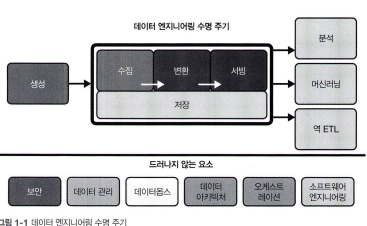

# Data Engineering

## 데이터 엔지니어링이란?
### 데이터 엔지니어링
-  원시데이터를 가져와 분석 및 머신러닝과 같은 다운스트림(시스템 흐름에서 "이후 단계"에 위치한 작업) 사용 사례를 지원하는, 고품질의 일관된 정보를 생성하는 시스템과 프로세스의 개발, 구현 및 유지 관리.
-  보안, 데이터 관리, 운영, 아키텍쳐(조직 내에서 데이터를 어떻게 관리하고 활용할지에 대한 구조적 설계), 오케스트레이션, 소프트웨어 엔지니어링의 교차점.
### 데이터 엔지니어
-  원천 시스템에서 데이터를 가져오는 것부터, 분석 또는 머신러닝과 같은 사용 사례에 데이터를 제공하는 것으로 끝나는 데이터 엔지니어링 수명 주기 관리.

#### 데이터 엔지니어링 수명 주기

- 데이터 엔지니어링 수명 주기는 **드러나지 않는 요소**라는 개념을 포함 -> 보안, 데이터 관리, 데이터 옵스, 데이터 아키텍쳐, 오케스트레이션, 소프트웨어 엔지니어링이 포함.